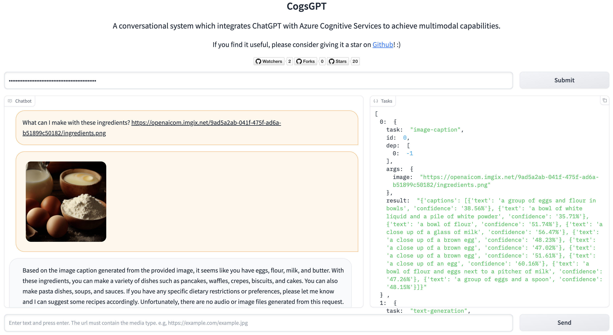

# CogsGPT
A conversational system which integrates ChatGPT with Azure Cognitive Services to achieve multimodal capabilities.

<a src="https://img.shields.io/badge/%F0%9F%A4%97-Open%20in%20Spaces-blue" href="https://huggingface.co/spaces/whiskyboy/CogsGPT">
    
</a>



*If you find this repo useful, please consider giving it a star! :)*

## Updates
- [2023.04.28] **Now you can go to [CogsGPT on Hugging Face Space](https://huggingface.co/spaces/whiskyboy/CogsGPT) to experience the full capabilities of CogsGPT!!!** We are offering an Azure Cognitive Service resource for FREE to use in the demo. All you need is an OpenAI API key to get started chatting with CogsGPT!
- [2023.04.25] CogsGPT now supports **image** type output! You can ask CogsGPT to crop a thumbnail of an image, or remove its background.
- [2023.04.18] Release the first version of CogsGPT!

## Overview

### What is Azure Cognitive Service
*(Answered by ChatGPT)*

> Azure Cognitive Services is a collection of pre-built machine learning models that developers can use to add intelligent features to their applications without requiring extensive knowledge of data science or machine learning. These services include vision, speech, language, and decision-making capabilities, such as text translation, speech recognition, image recognition, and sentiment analysis. Azure Cognitive Services allows developers to quickly and easily incorporate advanced AI features into their applications, reducing the time and cost of building such features from scratch. It also provides enterprise-level security, scalability, and availability for applications that require high levels of reliability and performance.

### What is CogsGPT
CogsGPT is a conversational system which utilizes the ChatGPT model as the controller and integrates with Azure Cognitive Services as collaborative executors to achieve multimodal capabilities to some extent. Using CogsGPT, you can simply access Azure Cognitive Services via natural language to process image or audio inputs, without any knowledge of the underlying APIs. You can even ask CogsGPT to perform some complex tasks such as summarizing a long speech into a short audio clip while retaining the main information. CogsGPT will automatically decide which services to use and how to use them to achieve the goal.

### How does CogsGPT work

The workflow of CogsGPT consists of three stages:
1. Task Planing Stage: In this stage, CogsGPT will leverage ChatGPT to parse user's input into a sequence of Azure Cognitive Service tasks which have the most potentials to solve user's request. Each task may depend on the execution result of previous tasks.
2. Task Execution Stage: In this stage, CogsGPT will execute the tasks sequentially. The execution results will be stored for future reference.
3. Response Generation Stage: In this stage, CogsGPT will leverage ChatGPT again to generate a final response to user's request based on the execution results of the second stage. The response may be a text, an image, an audio, or a combination of them.

## Getting Started

### Prerequisites

- Python 3.8+
- OpenAI API key
- Azure Cognitive Multi-Services resource ([How to deploy](https://learn.microsoft.com/en-us/azure/cognitive-services/cognitive-services-apis-create-account?tabs=multiservice%2Canomaly-detector%2Clanguage-service%2Ccomputer-vision%2Clinux#create-a-new-azure-cognitive-services-resource))
- Set the following environment variables:
    ```bash
    # OpenAI
    export OPENAI_API_TYPE="openai"
    export OPENAI_API_KEY="<OpenAI API Key>"

    # Azure Cognitive Service
    export COGS_ENDPOINT="<Azure Cognitive Service Endpoint>"
    export COGS_KEY="<Azure Cognitive Service Key>"
    export COGS_REGION="<Azure Cognitive Service Region>"
    ```

### Quick Install

```bash
pip install cogsgpt
```

### Usage

You can use CogsGPT in your own application to process image or audio inputs within three lines of codes:
```python
from cogsgpt import CogsGPT

agent = CogsGPT(model_name="gpt-3.5-turbo")
agent.chat("What's the content in a.jpg?")
```

For more details of the usage, please refer to the [API Reference](https://whiskyboy.github.io/cogsgpt/awesome_chat.html)

### Gradio Demo

The CogsGPT Gradio demo is now available on [Hugging Face Space](https://huggingface.co/spaces/whiskyboy/CogsGPT)! To make it easier and more affordable to try out the capabilities of CogsGPT, we are offering an Azure Cognitive Service resource for FREE to use in the demo! All you need is an OpenAI API key to get started chatting with CogsGPT!

You can also use the following commands to run the demo locally with your own Azure Cognitive Service resources (Don't forget to set the environment variables first!):
```bash
pip install gradio
python app.py
```

Now open your favorite browser and ENJOY YOUR CHAT!

## Acknowledgment

This project is inspired by [HuggingGPT](https://github.com/microsoft/JARVIS), and is built on top of [LangChain](https://github.com/hwchase17/langchain).

## License

This project is licensed under the MIT License - see the [LICENSE](LICENSE) file for details

## Contributing

As an open source project, we welcome contributions and suggestions. Please follow the [fork and pull request](https://docs.github.com/en/get-started/quickstart/contributing-to-projects) workflow to contribute to this project. Please do not try to push directly to this repo unless you are maintainer.

## Contact

If you have any questions, please feel free to contact us via <weitian.bnu@gmail.com>
